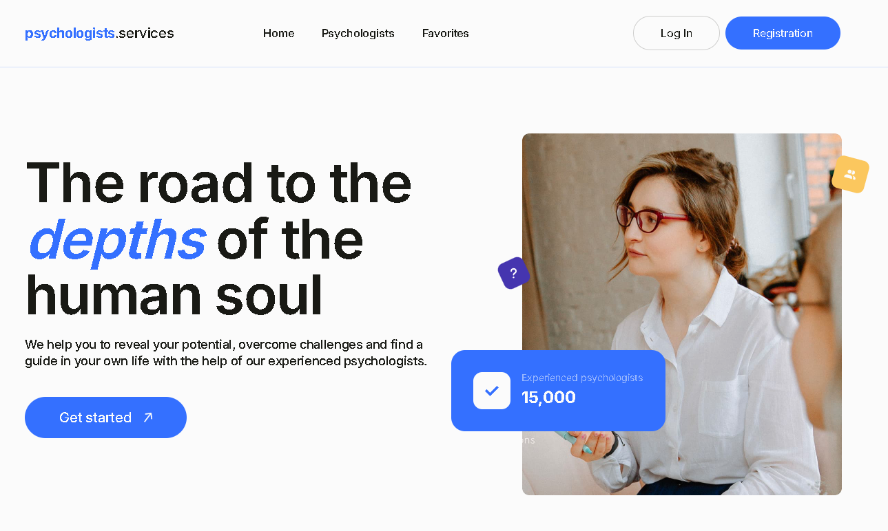
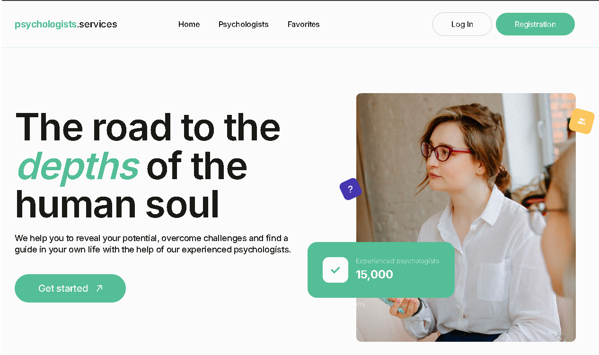
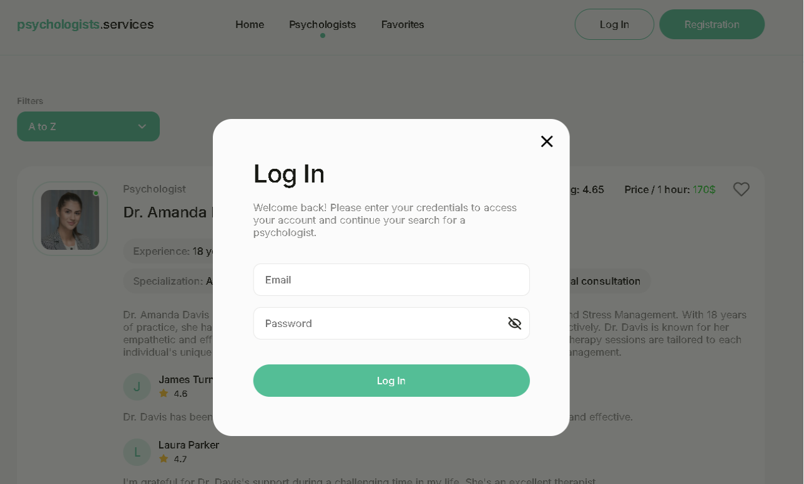

# Psychologists Services

Вебзастосунок для компанії, що надає послуги психологів. Проєкт реалізований як односторінковий застосунок із нативною маршрутизацією, авторизацією користувачів та інтерактивним каталогом психологів.

---

## 🔗 Live Demo

- https://psychologists-services-kxhb.onrender.com/

---

## 🎨 Макет

- Figma:  
  https://www.figma.com/file/I5vjNb0NsJOpQRnRpMloSY/Psychologists.Services

---

## 📄 Технічне завдання

- Google Docs:  
  https://docs.google.com/document/d/1PrTxBn6HQbb0Oz17g5_zvyLGIOZg0TIP3HPaEEp6ZLs/edit

---

## 📌 Сторінки застосунку

- **Home**  
  Головна сторінка з заголовком, слоганом компанії та CTA-посиланням для початку роботи із застосунком.

- **Psychologists**  
  Сторінка з переліком психологів, що підтримує:
  - сортування за алфавітом (A–Z / Z–A),
  - сортування за ціною (від найнижчої / від найвищої),
  - сортування за популярністю (рейтинг),
  - дозавантаження карток по кнопці **Load more**,
  - перегляд детальної інформації через **Read more**,
  - запис на консультацію через **Make an appointment**.

- **Favorites (private)**  
  Приватна сторінка з психологами, доданими користувачем до обраних. Доступна лише для авторизованих користувачів.

---

## ✅ Функціонал

### Авторизація (Firebase)

- реєстрація користувача
- логін
- отримання даних поточного користувача
- логаут

### Психологи (Firebase Realtime Database)

Колекція психологів містить наступні поля:

- `name`
- `avatar_url`
- `experience`
- `reviews`
- `price_per_hour`
- `rating`
- `license`
- `specialization`
- `initial_consultation`
- `about`

Для наповнення колекції використовується файл `psychologists.json`.

### Favorites

- Клік по кнопці у вигляді “серця”:
  - **неавторизований користувач** — отримує повідомлення, що функціонал доступний лише після авторизації
  - **авторизований користувач** — може додати або видалити психолога зі списку обраних
- Стан обраних зберігається після перезавантаження сторінки (через `localStorage` або Firebase).

### Модальні вікна

- Модальне вікно авторизації
- Модальне вікно запису на консультацію  
  Обидві форми:
  - мають мінімальну валідацію полів
  - закриваються по кліку на “хрестик”
  - закриваються по кліку на backdrop
  - закриваються по натисканню клавіші `Esc`

---

## 🧭 Маршрутизація

Маршрутизація реалізована **нативно на JavaScript** з використанням `history.pushState()` та `popstate` без сторонніх бібліотек.  
Зміна маршруту відбувається без перезавантаження сторінки.

---

## 🧰 Технології

- HTML
- CSS
- JavaScript (Vanilla)
- Vite (збірка)
- Firebase (Authentication, Realtime Database)

---

## 🚀 Getting Started

First, install dependencies:

```bash
npm i
# or
yarn
# or
pnpm i
# or
bun install
```

Environment variables

Configure your environment variables:

```bash
cp .env.example .env
# Fill in: BASE_URL, etc.
```

Then, run the development server:

```bash
npm run dev
# or
yarn dev
# or
pnpm dev
# or
bun dev
```

Open [http://localhost:5173](http://localhost:5173) with your browser to see the result.

To build the project:

```bash
npm run build
```

To preview the production build locally:

```bash
npm run preview
```

## Screenshots

### Home page - three color themes






### Psychologists catalog


### Login modal



### Psychologist card


